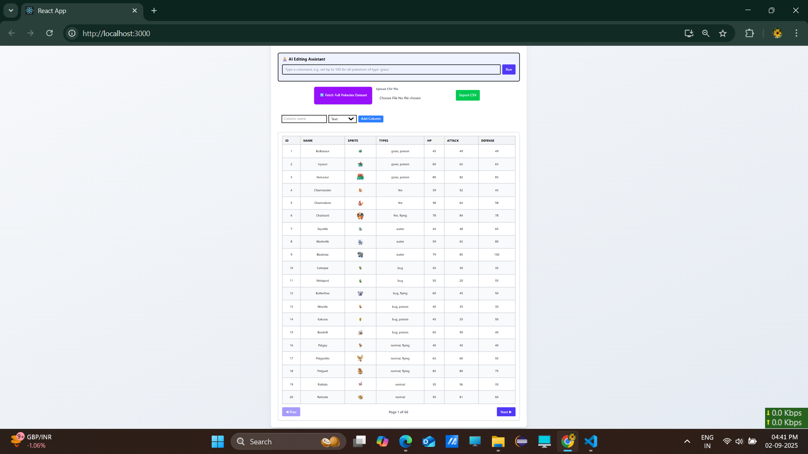

# first setup the react project using the command
npm install -g create-react-app

npx create-react-app pokemon_research

# For project run
npm install

npm start

# front page UI

## 📸 Screenshot

# install Zustand 

npm install zustand

npm install papaparse

# setup the tailwind css 

direct paste the CDN Link in Index.html file
  

  # Architectural decision (file and folder structure)
  src 
  folder: pages 
  file : Home.js
  folder: services
  file: pokeApiService.js
  folder: store
  file: pokemonStore.js
  folder: utils
  file : exportCSV.js

  Components
  folder: Modals
  file: AddColumnModal.js
  folder: Table
  file: DataTable.js
  folder: UI
  file : ExportButton.js
  Folder: Upload
  file: CSVUploader.js

# Performance Optimizations
 1. Api layer : external data fetching is abstracted into a service to keep logic clean.

 2 . Lazy Loading

 3. Tailwind CSS
 Used for rapid styling responsive design without bloating the bundle size.

 
 # Challenges and Solutions
 Handling large CSV files:Implemented chunked parsing and optimized rendering using virtualization (e.g., react-window) to prevent UI lag.
 
 2. Dynamic column manipulation: Used json2csv to ensure exported files are clean, readable, and compatible across platforms.

3. PokeApi rate Limits: manually settings for limits to avoid the breaking ui for large dataset.

4. Using Pagination concpet to avoid slow loading the data and also make the ui better and fast feels.

# Pokemon_Research_Lab
Purpose of this project to fetch the dataset of all Pokemon it from the PokeApi( using react.js fetch and tailwindcss , zustand for state management , for uploading csv files used  papaparse etc )

